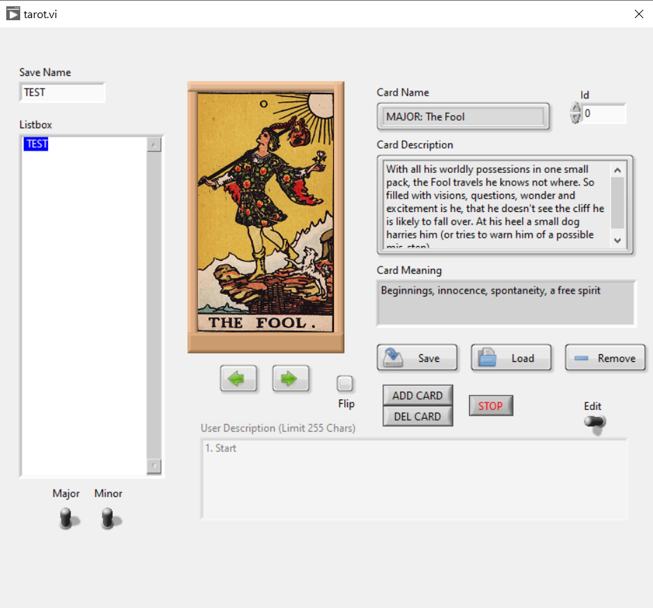
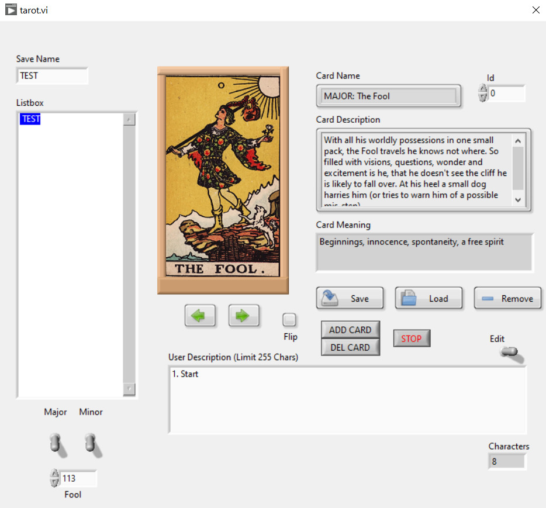

# Tarot

A Tarot reading desktop application built in **LabVIEW (G)** (2021, v1.0.0.4).

Draw and interpret cards from a full 78-card deck (Major + Minor Arcana), with an
in-app save system and a database-backed catalogue of card meanings.

## Features

- **Card engine** — full deck: 22 Major Arcana + the Minor Arcana, with artwork for every card (`images/`).
- **Built-in save system** — readings/sessions are persisted from inside the app.
- **Database backend** — card data and meanings live in an MS Access (Jet) database, accessed over OLE DB.
- Packaged as a standalone Windows application.

## Stack

LabVIEW (G) · MS Access / Jet (OLE DB) · Windows executable

## Repository layout

| Path | What it is |
| --- | --- |
| `_run/tarot.exe` | The built application. LabVIEW compiles the VIs into the executable, so the **block diagrams (the editable source) open directly from the exe in the LabVIEW IDE**. |
| `images/major`, `images/minor` | Card artwork. |
| `database.mdb` | Access database with the card catalogue. |
| `tarot.udl` | OLE DB connection file — points the app at the database. |

> LabVIEW VIs are binary, so GitHub won't render the diagrams. Open `_run/tarot.exe`
> in LabVIEW to view/edit the code.

## Running it

1. Install the matching **LabVIEW Run-Time Engine**.
2. Edit `tarot.udl` — set `Data Source` to the local path of `database.mdb` on your machine.
3. Run `_run/tarot.exe`.
